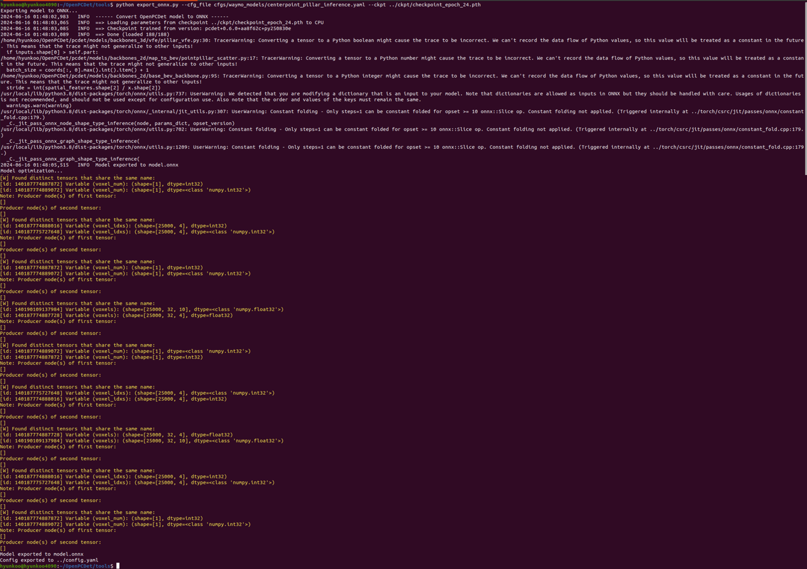
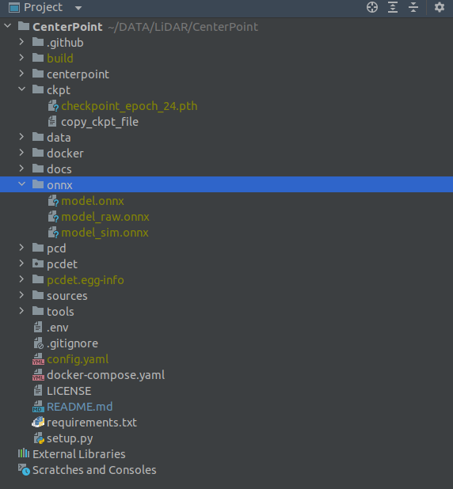

# OpenPCDet

- `OpenPCDet` is a clear, simple, self-contained open source project for LiDAR-based 3D object detection. 
- This repository is dedicated solely to inferencing the CenterPoint-pointpillar model.

# Docker Environment
- Base Image: [`nvcr.io/nvidia/tensorrt:23.04-py3`](https://docs.nvidia.com/deeplearning/tensorrt/container-release-notes/index.html#rel_23-04)
- OS: Ubuntu 20.24
- CUDA: 12.1.0
- cuDNN: 8.9.0
- TensorRT: 8.6.1
- python: 3.8
- Pytorch: 2.1.1

## 1. Set Dev Environment using Docker Env 
- Please follow [docs/1_Set_Environment_using_Docker.md](docs/1_Set_Environment_using_Docker.md) and proceed with the instructions.

## 2 Prepare Datasets 
- Please follow [docs/2_Prepare_Waymo_Dataset.md](docs/2_Prepare_Waymo_Dataset.md) and proceed with the instructions.

### 1.5 Prepare Datasets 

- For Waymo datasets, Install the official `waymo-open-dataset` by running the following command:
``` shell
docker exec -it centerpointpillar bash
pip install --upgrade pip
sudo apt install python3-testresources
pip install waymo-open-dataset-tf-2-12-0==1.6.4
```

- Extract point cloud data from tfrecord and generate data infos by running the following command (it takes several hours, and you could refer to `data/waymo/waymo_processed_data_v0_5_0` to see how many records that have been processed):
``` shell
# only for single-frame setting: without 'elongation' in the 'used_feature_list'
python -m pcdet.datasets.waymo.waymo_dataset --func create_waymo_infos \
    --cfg_file tools/cfgs/dataset_configs/waymo_dataset_use_feature_no_elongation.yaml
    
# only for single-frame setting
python -m pcdet.datasets.waymo.waymo_dataset --func create_waymo_infos \
    --cfg_file tools/cfgs/dataset_configs/waymo_dataset.yaml

# for single-frame or multi-frame setting
python -m pcdet.datasets.waymo.waymo_dataset --func create_waymo_infos \
    --cfg_file tools/cfgs/dataset_configs/waymo_dataset_multiframe.yaml
# Ignore 'CUDA_ERROR_NO_DEVICE' error as this process does not require GPU.
```

- Please refer to the [docs/GETTING_STARTED.md](docs/GETTING_STARTED.md) for more details.

### 1.6 PCDET Installation

- Execute the container
```
docker exec -it centerpointpillar bash
```

- Install OpenPCDet based CenterPointPillar
``` shell
cd ~/CenterPointPillar
sudo python setup.py develop
```

- To Build Python module, you have to install and wrap the c++ to python API.
``` shell
cd ~/
git clone https://github.com/pybind/pybind11.git
cd pybind11
cmake .
sudo make install

cd ~/CenterPointPillar/centerpoint/pybind
cmake -BRelease
cmake --build Release
```

## 2) Train PCDET

### 2.1 Train using Multi-GPUs 
- If you use pytorch 1.x, you have to use `python -m torch.distributed.launch` i.e., `tools/scripts/dist_X.sh`
- If you use pytorch 2.x, you have to use `torchrun` i.e., `tools/scripts/torch_train_X.sh`
``` shell
cd ~/CenterPointPillar
ln -s /Dataset/Train_Results/CenterPoint/ output  # you can replace `/Dataset/Train_Results/CenterPoint/` with directory you want
cd tools/
sh scripts/torch_train.sh 2 --cfg_file ./cfgs/waymo_models/centerpoint_pillar_train.yaml --batch_size 24
```

### 2.2 Train using Single-GPU
``` shell
cd ~/CenterPointPillar
ln -s /Dataset/Train_Results/CenterPoint/ output
cd tools/
CUDA_VISIBLE_DEVICES=1 python train.py --cfg_file ./cfgs/waymo_models/centerpoint_pillar_train.yaml --batch_size 16  # you can replace `CUDA_VISIBLE_DEVICES=1` with gpu's number you want
```


## 3) Usage: Inference Method using ROS2 *Python* Node on the Container ENV

### 3.1 ROS2 play bagfile on the container
```
docker exec -it centerpointpillar bash
cd /Dataset
ros2 bag play segment-10359308928573410754_720_000_740_000_with_camera_labels/  # ros2 bag play folder_with_ros2bag
```

### 3.2 execute ros2_demo.py on the container
``` shell
docker exec -it centerpointpillar bash
cd ~/CenterPointPillar/tools/
python ros2_demo.py --cfg_file cfgs/waymo_models/centerpoint_pillar_inference.yaml --ckpt ../ckpt/checkpoint_epoch_24.pth
```

### 3.3 execute rviz2
``` shell
docker exec -it centerpointpillar bash
rviz2
```

### 3.4 setting rviz2
- Fixed Frame: base_link
- Add -> By display type -> PountCloud2 -> Topic: /lidar/top/pointcloud, Size(m): 0.03
- Add -> By topic -> /boxes/MarkerArray


### 3.5 run rviz2

<!-- show picture sources/fig1.png-->


## 4) Usage: Inference Method using ROS2 *C++* Node on the Container ENV (Comming soon....)

### 4.1 Convert Onnx file from Pytorch 'pth' model file
``` shell
docker exec -it centerpointpillar bash
cd ~/CenterPointPillar/tools
python export_onnx.py --cfg_file cfgs/waymo_models/centerpoint_pillar_inference.yaml --ckpt ../ckpt/checkpoint_epoch_24.pth

```


As a result, create 3 onnx files on the `CenterPoint/onnx`
- model_raw.onnx: pth를 onnx 로 변환한 순수 버전
- model_sim.onnx: onnx 그래프 간단화해주는 라이브러리 사용한 버전
- model.onnx: sim 모델을 gragh surgeon으로 수정한 최종 버전, tensorRT plugin 사용하려면 gragh surgeon이 필수임.



### 4.2 Copy Onnx file to the `model` folder in ROS2  
``` shell
cd ~/CenterPointPillar/
cp onnx/model.onnx centerpoint/model/

```

### 4.3 ROS2 C++ Node
- Build the ROS2 package in your ROS2 workspace.
``` shell
cd ~/ && mkdir -p ros2_ws/src && cd ros2_ws/ && colcon build --symlink-install
cd src && ln -s CenterPointPillar/centerpoint .
cd src/centerpoint && mkdir model
cd ~/ros2_ws && colcon build --symlink-install
source ~/ros2_ws/install/setup.bash
```

### 4.4 Run the ROS2 Node.
``` shell
ros2 launch centerpoint centerpoint.launch.py
```

- Once running ros2 centerpoint node, create tensorRT file to the same folder having onnx file, automatically.

### 4.5 ROS2 play bagfile on the container
```
docker exec -it centerpointpillar bash
cd /Dataset
ros2 bag play segment-10359308928573410754_720_000_740_000_with_camera_labels/  # ros2 bag play folder_with_ros2bag
```

### 4.6 Run rviz2
``` shell
docker exec -it centerpointpillar bash
rviz2
```
- Fixed Frame: base_link
- Add -> By display type -> PountCloud2 -> Topic: /lidar/top/pointcloud, Size(m): 0.03
- Add -> By topic -> /boxes/MarkerArray


## 5) Evaluation

- Install pybind11 (if you already installed in the `1.6 PCDET Installation`, skip please)
``` shell
cd ~/
git clone git@github.com:pybind/pybind11.git
cd pybind11
cmake .
make install
```

- To evaluate TensorRT results, you have to wrap the c++ to python API. (if you already installed in the training step, skip please)
- Build Python module 
``` shell
cd centerpoint/pybind
cmake -BRelease
cmake --build Release
```

### 5.1 Evaluation with pytorch model
``` shell
docker exec -it centerpointpillar bash
cd ~/CenterPointPillar/tools/
python test.py --cfg_file cfgs/waymo_models/centerpoint_pillar_inference.yaml --ckpt ../ckpt/checkpoint_epoch_24.pth
```

- Results as shown:
```
OBJECT_TYPE_TYPE_VEHICLE_LEVEL_1/AP: 0.6203 
OBJECT_TYPE_TYPE_VEHICLE_LEVEL_1/APH: 0.6136 
OBJECT_TYPE_TYPE_VEHICLE_LEVEL_1/APL: 0.6203 
OBJECT_TYPE_TYPE_VEHICLE_LEVEL_2/AP: 0.5416 
OBJECT_TYPE_TYPE_VEHICLE_LEVEL_2/APH: 0.5357 
OBJECT_TYPE_TYPE_VEHICLE_LEVEL_2/APL: 0.5416 
OBJECT_TYPE_TYPE_PEDESTRIAN_LEVEL_1/AP: 0.5325 
OBJECT_TYPE_TYPE_PEDESTRIAN_LEVEL_1/APH: 0.2886 
OBJECT_TYPE_TYPE_PEDESTRIAN_LEVEL_1/APL: 0.5325 
OBJECT_TYPE_TYPE_PEDESTRIAN_LEVEL_2/AP: 0.4550 
OBJECT_TYPE_TYPE_PEDESTRIAN_LEVEL_2/APH: 0.2467 
OBJECT_TYPE_TYPE_PEDESTRIAN_LEVEL_2/APL: 0.4550 
OBJECT_TYPE_TYPE_SIGN_LEVEL_1/AP: 0.0000 
OBJECT_TYPE_TYPE_SIGN_LEVEL_1/APH: 0.0000 
OBJECT_TYPE_TYPE_SIGN_LEVEL_1/APL: 0.0000 
OBJECT_TYPE_TYPE_SIGN_LEVEL_2/AP: 0.0000 
OBJECT_TYPE_TYPE_SIGN_LEVEL_2/APH: 0.0000 
OBJECT_TYPE_TYPE_SIGN_LEVEL_2/APL: 0.0000 
OBJECT_TYPE_TYPE_CYCLIST_LEVEL_1/AP: 0.3282 
OBJECT_TYPE_TYPE_CYCLIST_LEVEL_1/APH: 0.2738 
OBJECT_TYPE_TYPE_CYCLIST_LEVEL_1/APL: 0.3282 
OBJECT_TYPE_TYPE_CYCLIST_LEVEL_2/AP: 0.3156 
OBJECT_TYPE_TYPE_CYCLIST_LEVEL_2/APH: 0.2633 
OBJECT_TYPE_TYPE_CYCLIST_LEVEL_2/APL: 0.3156 
```

### 5.2 Evaluation with TensorRT model
``` shell
docker exec -it centerpointpillar bash
cd ~/CenterPointPillar/tools/
python test.py --cfg_file cfgs/waymo_models/centerpoint_pillar_inference.yaml --TensorRT
```

- Results as shown:
```
2024-07-07 05:33:34,115   INFO  
OBJECT_TYPE_TYPE_VEHICLE_LEVEL_1/AP: 0.5724 
OBJECT_TYPE_TYPE_VEHICLE_LEVEL_1/APH: 0.5667 
OBJECT_TYPE_TYPE_VEHICLE_LEVEL_1/APL: 0.5724 
OBJECT_TYPE_TYPE_VEHICLE_LEVEL_2/AP: 0.4969 
OBJECT_TYPE_TYPE_VEHICLE_LEVEL_2/APH: 0.4919 
OBJECT_TYPE_TYPE_VEHICLE_LEVEL_2/APL: 0.4969 
OBJECT_TYPE_TYPE_PEDESTRIAN_LEVEL_1/AP: 0.5827 
OBJECT_TYPE_TYPE_PEDESTRIAN_LEVEL_1/APH: 0.3159 
OBJECT_TYPE_TYPE_PEDESTRIAN_LEVEL_1/APL: 0.5827 
OBJECT_TYPE_TYPE_PEDESTRIAN_LEVEL_2/AP: 0.5036 
OBJECT_TYPE_TYPE_PEDESTRIAN_LEVEL_2/APH: 0.2730 
OBJECT_TYPE_TYPE_PEDESTRIAN_LEVEL_2/APL: 0.5036 
OBJECT_TYPE_TYPE_SIGN_LEVEL_1/AP: 0.0000 
OBJECT_TYPE_TYPE_SIGN_LEVEL_1/APH: 0.0000 
OBJECT_TYPE_TYPE_SIGN_LEVEL_1/APL: 0.0000 
OBJECT_TYPE_TYPE_SIGN_LEVEL_2/AP: 0.0000 
OBJECT_TYPE_TYPE_SIGN_LEVEL_2/APH: 0.0000 
OBJECT_TYPE_TYPE_SIGN_LEVEL_2/APL: 0.0000 
OBJECT_TYPE_TYPE_CYCLIST_LEVEL_1/AP: 0.3070 
OBJECT_TYPE_TYPE_CYCLIST_LEVEL_1/APH: 0.2551 
OBJECT_TYPE_TYPE_CYCLIST_LEVEL_1/APL: 0.3070 
OBJECT_TYPE_TYPE_CYCLIST_LEVEL_2/AP: 0.2953 
OBJECT_TYPE_TYPE_CYCLIST_LEVEL_2/APH: 0.2453 
OBJECT_TYPE_TYPE_CYCLIST_LEVEL_2/APL: 0.2953
```
