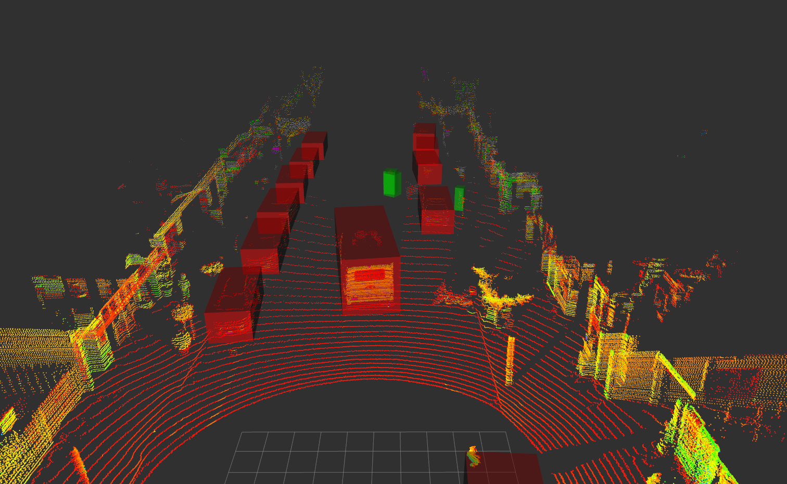

# PointPillar based CenterPoint

## Basis Codes: OpenPCDet and CenterPoint

- `OpenPCDet` is a clear, simple, self-contained open source project for LiDAR-based 3D object detection. 
  - [OpenPCDet](https://github.com/open-mmlab/OpenPCDet.git) repository is dedicated solely to inferencing the [CenterPoint-pointpillar](https://arxiv.org/abs/2006.11275) model, Center-based 3D Object Detection and Tracking.     
  - I also improved the [OpenPCDet](https://github.com/open-mmlab/OpenPCDet.git) with [Mr. JongRok-Lee](https://github.com/JongRok-Lee) in the following repository:
    - https://github.com/JongRok-Lee/CenterPoint.git
    - https://github.com/hyunkoome/CenterPoint.git 
    

## Docker Environment
- Base Image: [`nvcr.io/nvidia/tensorrt:23.04-py3`](https://docs.nvidia.com/deeplearning/tensorrt/container-release-notes/index.html#rel_23-04)
- OS: Ubuntu 20.24
- CUDA: 12.1.0
- cuDNN: 8.9.0
- TensorRT: 8.6.1
- python: 3.8
- Pytorch: 2.1.1

## 1. Setting Dev Environment using Docker Env 
- Please follow [docs/1_Setting_Environment_using_Docker.md](docs/1_Setting_Environment_using_Docker.md) and proceed with the instructions.

## 2 Preparing Datasets 
- Please follow [docs/2_Preparing_Waymo_Dataset.md](docs/2_Preparing_Waymo_Dataset.md) and proceed with the instructions.

## 3. Setting OpenPCDet.
- Please follow [docs/3_Setting_OpenPCDet.md](docs/3_Setting_OpenPCDet.md) and proceed with the instructions.

## 4. Training a model.
- Please follow [docs/4_Training.md](docs/4_Training.md) and proceed with the instructions.

## 5. Testing a model and Evaluation with Pytorch models.
- Please follow [docs/5_Testing_Evaluation.md](docs/5_Testing_Evaluation.md) and proceed with the instructions.

## 6. Convert ONNX models from Pytorch models
- Please follow [docs/6_Convert_Models.md](docs/6_Convert_Models.md) and proceed with the instructions.

## 7. Testing a model and Evaluation with TensorRT models.
- Please follow [docs/7_Testing_Evaluation_with_TensorRT.md](docs/7_Testing_Evaluation_with_TensorRT.md) and proceed with the instructions.

## 8. Inference a model with TensorRT on ROS2 (Python)
- Please follow [docs/8_Inference_ROS2_TensorRT_Python.md](docs/8_Inference_ROS2_TensorRT_Python.md) and proceed with the instructions.

## 9. Inference a model with TensorRT on ROS2 (C++)
- Please follow [docs/9_Inference_ROS2_TensorRT_Cpp.md](docs/9_Inference_ROS2_TensorRT_Cpp.md) and proceed with the instructions.

<!-- show picture sources/fig1.png-->

------------------------------------------------------------------------------------------

## TODO

- [x] Fixed codes.
- [x] Updated README.md files.
- [ ] Refactoring Phase1: Remove all codes not related to centerpoint-pillar.
  - [ ] Remove codes not related to network models (centerpoint-pillar).
  - [ ] Remove codes not related to waymo dataset.
  - [ ] Remove codes not related to functions.
  - [ ] Remove all parameters not related to centerpoint-pillar in the `config.yaml` files (networks and datasets).
  - [ ] Remove duplicated parameters in the `config.yaml` files (networks and datasets).
  - [ ] Merge duplicated codes of header, source (c++ and cuda) for pybind and ROS.
- [ ] Refactoring Phase2: Restructure the codes and config files.
  - [ ] Restructure all codes.
  - [ ] Re-arranged parameters and restructured on the `config.yaml` files of datasets and models.
  - [ ] Fix the code to create proper config.yaml when running `export_onnx.py` with cfg_file `cfgs/waymo_models/centerpoint_pillar_inference.yaml`.
- [ ] Refactoring Phase3: Add unit test functions for python, c++, cuda.

