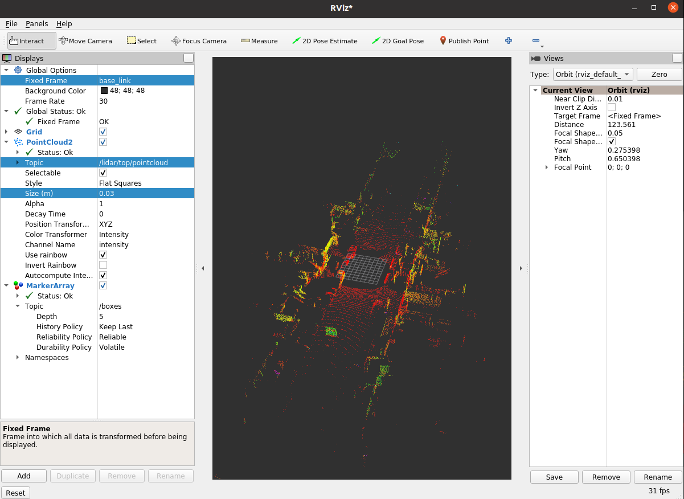

## (Python) Inference a model with TensorRT on ROS2 Node

### 1. Setting ROS2
- If you are not using a container env, please install ROS2 Foxy:
```
sudo apt install software-properties-common libyaml-cpp-dev -y && \
    sudo add-apt-repository universe && \
    sudo apt update && sudo apt install curl -y && \
    sudo curl -sSL https://raw.githubusercontent.com/ros/rosdistro/master/ros.key -o /usr/share/keyrings/ros-archive-keyring.gpg && \
    echo "deb [arch=$(dpkg --print-architecture) signed-by=/usr/share/keyrings/ros-archive-keyring.gpg] http://packages.ros.org/ros2/ubuntu $(. /etc/os-release && echo $UBUNTU_CODENAME) main" | sudo tee /etc/apt/sources.list.d/ros2.list > /dev/null && \
    sudo apt update && \
    sudo apt install ros-foxy-desktop python3-argcomplete -y && \
    sudo apt install ros-dev-tools ros-foxy-rqt* ros-foxy-tf-transformations -y
sudo pip install transforms3d -y
```

- If you are using a container env, your container already installed ROS2.

### 2. Convert Waymo dataset to Rosbag for ROS2
- You can use two repositories step by step. 
  - Waymo data ==> Rosbag for ROS1: https://github.com/yukke42/waymo2bag
    - 첫번째 깃허브로 ROS1 bag 파일로 만든 후
  - Rosbag for ROS1 ==> Rosbag for ROS2: https://ternaris.gitlab.io/rosbags/topics/convert.html
    - 2번째 라이브러리로 ros1을 ros2 bag파일로 변환하면 됨
  

### 3. ROS2 play bagfile on the container
```
docker exec -it centerpointpillar bash
cd /Dataset
ros2 bag play segment-10359308928573410754_720_000_740_000_with_camera_labels/  # ros2 bag play folder_with_ros2bag
```

### 4. Run ros2_demo.py on the container
``` shell
docker exec -it centerpointpillar bash
cd ~/CenterPointPillar/tools/
python ros2_demo.py --cfg_file cfgs/waymo_models/centerpoint_pillar_inference.yaml --ckpt ../ckpt/checkpoint_epoch_24.pth
```

### 5. Run rviz2
``` shell
docker exec -it centerpointpillar bash
rviz2
```

### 6. Setting rviz2
- Fixed Frame: base_link
- Add -> By display type -> PountCloud2 -> Topic: /lidar/top/pointcloud, Size(m): 0.03
- Add -> By topic -> /boxes/MarkerArray


### 7. Results with rviz2


## [Return to the main page.](../README.md)
