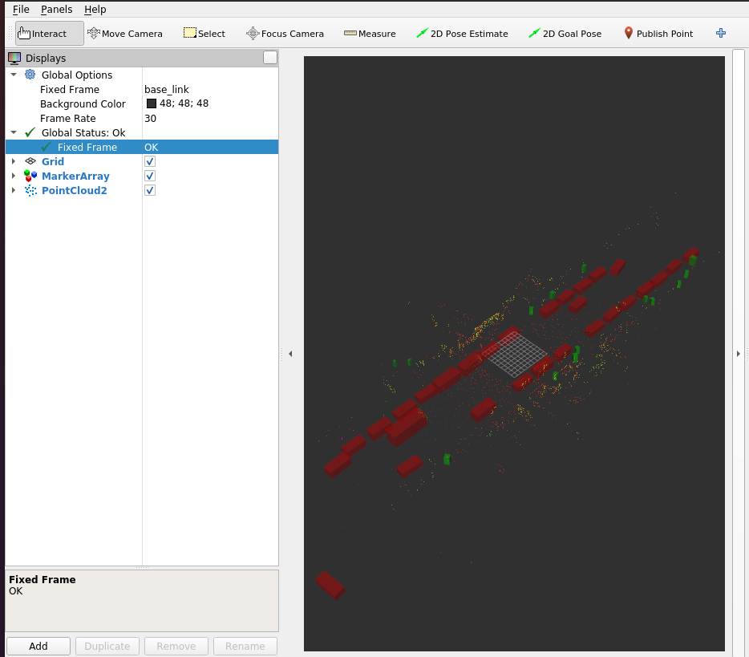

## (C++) Inference a model with TensorRT on ROS2 Node

### 1. Setting ROS2
- If you are not using a container env, please install ROS2 Foxy:
```
sudo apt install software-properties-common libyaml-cpp-dev -y && \
    sudo add-apt-repository universe && \
    sudo apt update && sudo apt install curl -y && \
    sudo curl -sSL https://raw.githubusercontent.com/ros/rosdistro/master/ros.key -o /usr/share/keyrings/ros-archive-keyring.gpg && \
    echo "deb [arch=$(dpkg --print-architecture) signed-by=/usr/share/keyrings/ros-archive-keyring.gpg] http://packages.ros.org/ros2/ubuntu $(. /etc/os-release && echo $UBUNTU_CODENAME) main" | sudo tee /etc/apt/sources.list.d/ros2.list > /dev/null && \
    sudo apt update && \
    sudo apt install ros-foxy-desktop python3-argcomplete -y && \
    sudo apt install ros-dev-tools ros-foxy-rqt* ros-foxy-tf-transformations -y
sudo pip install transforms3d -y
```

- If you are using a container env, your container already installed ROS2.

### 2. Build the ROS2 package of centerpoint c++ Node in your ROS2 workspace.
``` shell
docker exec -it centerpointpillar bash
cd ~/ && mkdir -p ros2_ws/src && cd ros2_ws/ && colcon build --symlink-install
cd src && ln -s ~/CenterPointPillar/centerpoint .
```
- If not exist `centerpoint/model`, copy `onnx` file.
``` shell
cd centerpoint && mkdir model
cd model
ln -s ~/CenterPointPillar/onnx/model.onnx model.onnx
```
- Build the ROS2 package of centerpoint c++ Node in your ROS2 workspace.
``` shell
cd ~/ros2_ws && colcon build --symlink-install
source ~/ros2_ws/install/setup.bash
```

### 3. Run the ROS2 Node.
``` shell
docker exec -it centerpointpillar bash
ros2 launch centerpoint centerpoint.launch.py
```

- Once running ros2 centerpoint node, create tensorRT file to the same folder having onnx file, automatically.

### 4. ROS2 play bagfile on the container
```
docker exec -it centerpointpillar bash
cd /Dataset
ros2 bag play segment-10359308928573410754_720_000_740_000_with_camera_labels/  # ros2 bag play folder_with_ros2bag
```

### 5. Run rviz2
``` shell
docker exec -it centerpointpillar bash
rviz2
```
- Fixed Frame: base_link
- Add -> By display type -> PountCloud2 -> Topic: /lidar/top/pointcloud, Size(m): 0.03
- Add -> By topic -> /boxes/MarkerArray



## [Return to the main page.](../README.md)
